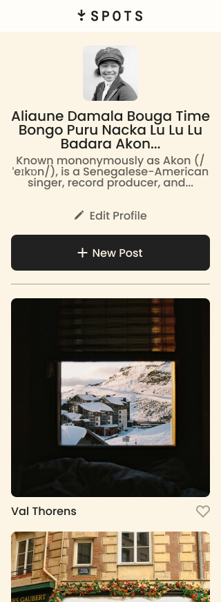

# Project 3: Spots

### Overview

## Spots - mock social media image sharing website

**Intro**

Project 3 is called "Spots". With this project, it resembles a mock version of a social media website. Where it allows people to create their own profiles and share and upload pictures of their persoanl lifes or whatever brings them joy. It also allows them to like other peoples pictures or vise versa. It was even made to be user friendly for both desktop and mobile users. Please explore and enjoy.

**Project features**

- CSS
- Grid
- Responsive design
- BEM Methodology
- HTML5

**Figma**

- [Link to the project](https://bigbet-coding.github.io/se_project_spots/)

- [Link to the video](https://drive.google.com/file/d/1uXkWvN6Mcjms5XHhKb_27afFSiS_mibY/view?usp=sharing)

**Images**

Combining flexbox and grid, a fully easy to read and use website was made. Utilizing this combo, it allows the responsive deign to operate well on well screen sizes.

The view of this mock socail media website rendering on a mobile type device.

This one shows the results of text overflow being used.

Here is a preview of the components used for the Logo, buttons, cursors and hover psuedo usage.

Good luck and enjoy!
